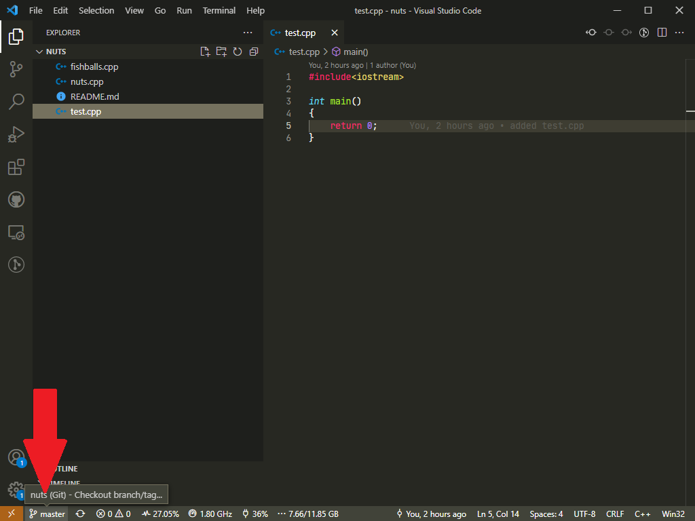
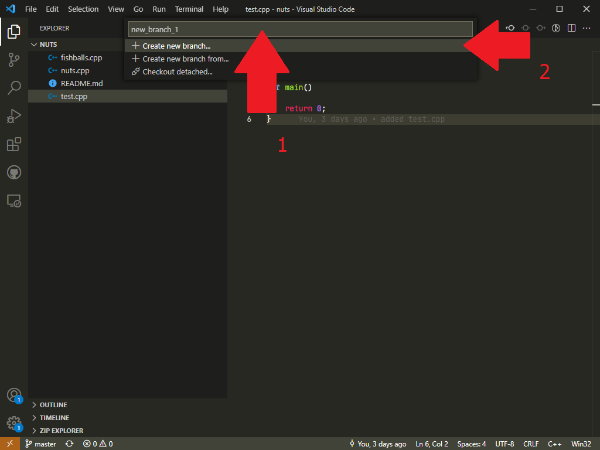
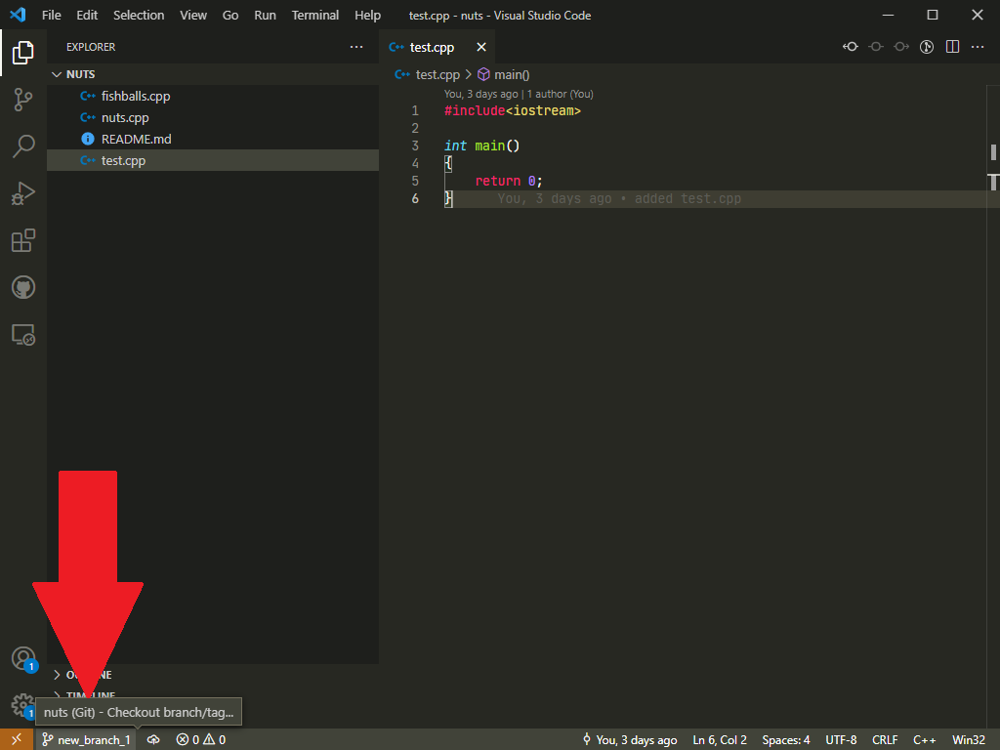
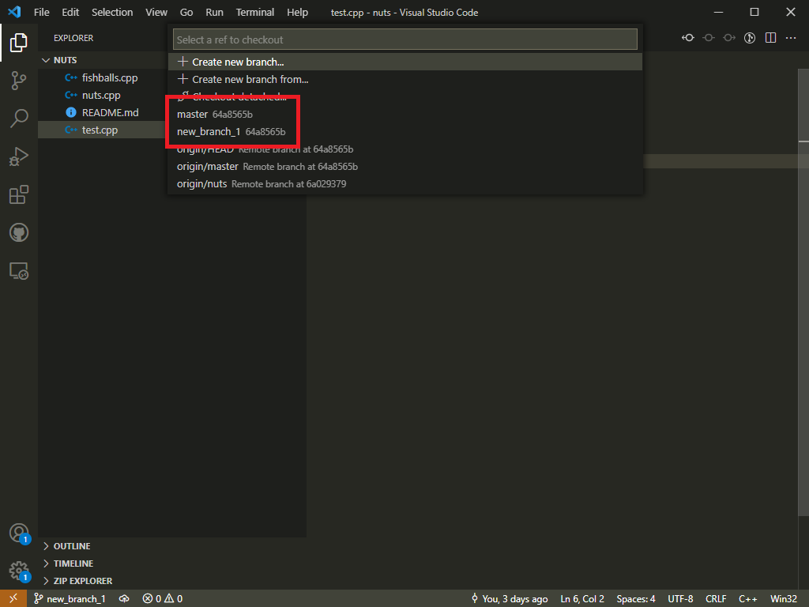

# How to switch to another branch

In this page will show you how to create/switch to another branch.

For example, you currently landed on the branch called `main/master` which is the first/HEAD(normally is) branch.

## Git Bash

To create a new branch,

1. go to [Git Bash](../done/gitbash.md) and [navigate to the location](src/terms.md)
2. Type in `git branch` to list out all the branches.
3. Type in `git branch`&nbsp;*`new_branch_name`* to create new branch without changing to it.
4. Type in `git checkout`&nbsp;*`new_branch_name`* to checkout to the newly created branch.

To change to another branch,

1. go to [Git Bash](../done/gitbash.md) and [navigate to the location](src/terms.md)
2. Type in `git branch` to list out all the branches.
3. Type in `git checkout`&nbsp;*`new_branch_name`* to checkout to the newly created branch.

## Visual Studio Code

To create a new branch,

1. Click on `master` button on the bottom left corner

    

2. Then you need to type in the branch

    

3. Now you are in the new branch!

    

To switch to another branch,

1. Click on `new_branch_1` (or whatever branch you are in) button on the bottom left corner

    

2. Then choose a branch to work on

    

3. Now you are in the new branch!

    
