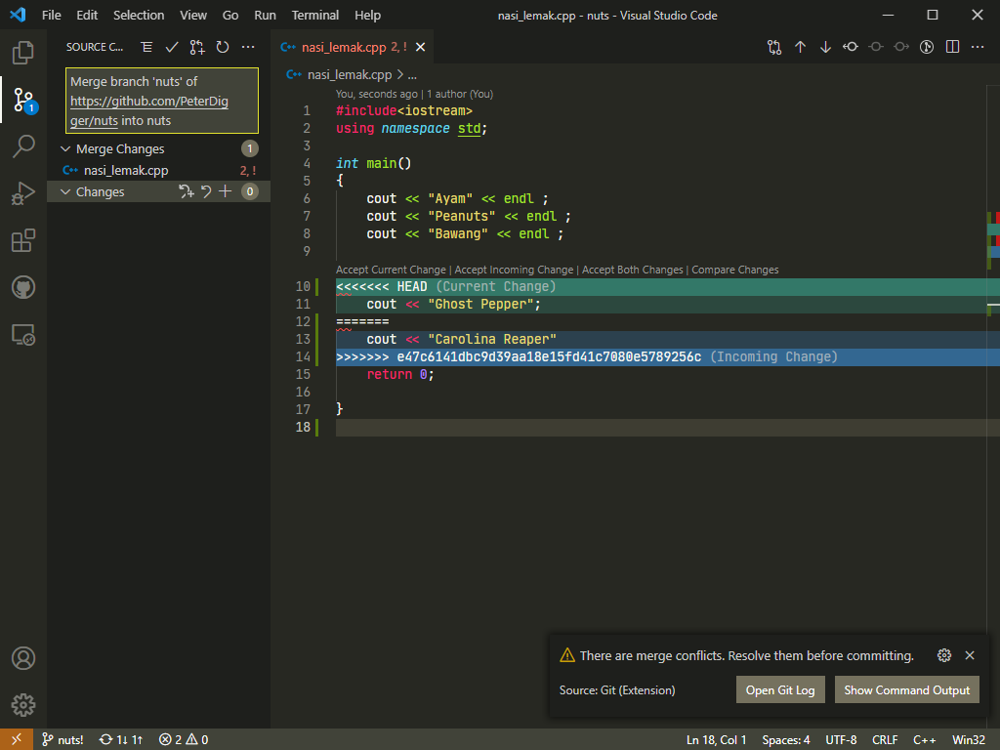

# What is merge conflict?

Most of the time, Git will figure things out on its own. But there's a moment when there are two same filename but the content are different from each other. When a user tries to merge two files together, it will get return `merge conflict`.

Merge conflict also can happen when there's contraditory changes happened when merging across branches.

So how merge conflict happened?

Simple analogy:

- You have the *`nasi_lemak.cpp`* and your friend is interested to work on it.
- So, you and your friend both are working on the *`nasi_lemak.cpp`* individually.
- Then your friend has updated the *`nasi_lemak.cpp`* and inside the *`nasi_lemak.cpp`* has Ghost pepper.
- You got Carolina Reaper in your *`nasi_lemak.cpp`* as well.
- When your friend tries to merge the file with yours, `Git` can't decide what's right and what's wrong.

Simple Illustration:

| Yours                                   | Friends                                                 |
|-----------------------------------------|---------------------------------------------------------|
| *`nasi_lemak.cpp`*  Last Commit: 15:45  | *`nasi_lemak.cpp`*  Last Commit: 15:45                  |
| Code(Line 17): `cout << "Ghost Pepper"` | Code(Line 17): `cout << "Carolina Reaper"`              |
| *`nasi_lemak.cpp`*  Last Commit: 16:00  | *`nasi_lemak.cpp`*  Last Commit: 15:45 (merge conflict) |

Since, `git` can't decide contraditory changes, what would it do?
Git will "dumps" everything inside the version that the person that tries to push/merge

How `Git` deal with merge conflict? Example of merge conflict:

```c++
<<<<<<< HEAD
    cout << "Ghost Pepper";
=======
    cout << "Carolina Reaper"
>>>>>>> "Friend_commit_id"
```

Real life example of how merge conflict happened:

You edited this:


Your friend edit this on the website:


Your friend changed one line and saved it (4:00pm):


You also changed one line and saved it:


But when you try to commit and push later (4:15pm):



You got merge conflict.

---

Also read:

- [How to resolve merge conflict?](solve_conflict.md)
- [What is Branch]
