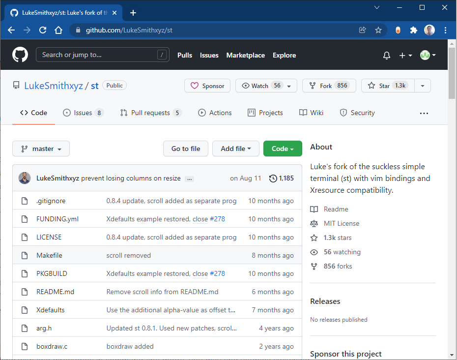
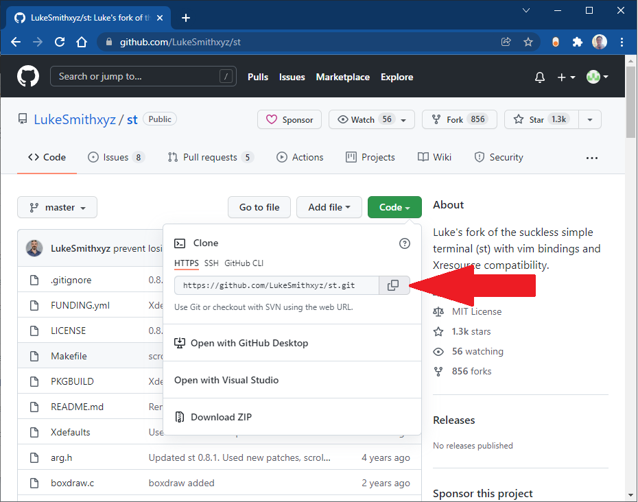

# How to get the link of someone's repository

This is an example of someone's repository

In order, to able clone, first, you need to click on Green button "Code" then click on copy button.

And Voilà! You can go ahead and paste it in your VS Code or your Terminal Git Bash
