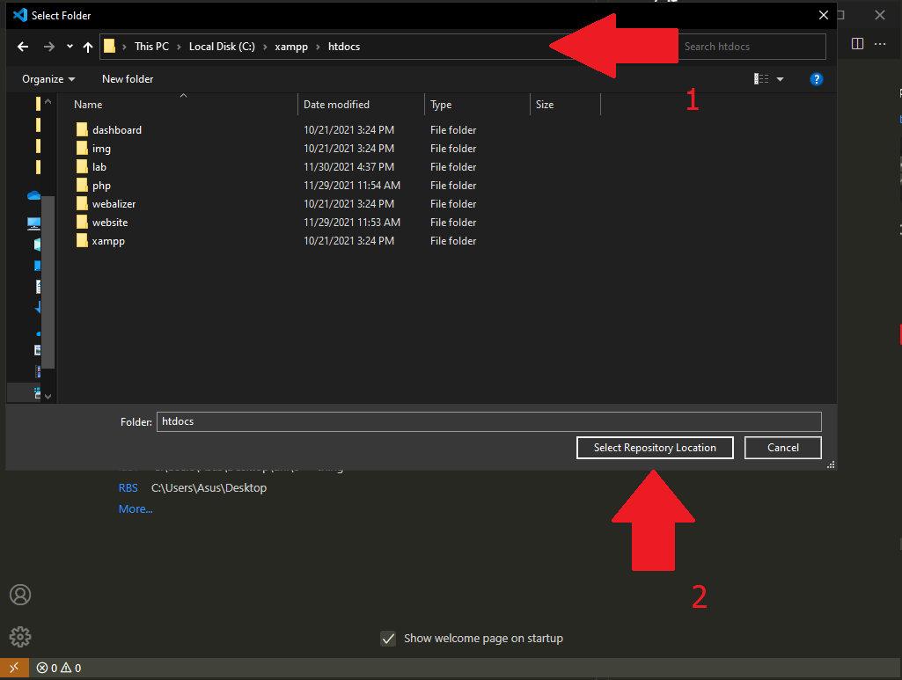

# How to setup for Web Programming Group Project?

Explaination:

Q: Why Do we need to put it in the repo inside htdocs folder?<br>
A: Its easier for you to edit the code while still able to use XAMPP to display the page on browser. Yet you can push the code whenever you want without making a mess.

Q: What should we do if we ever get messed up the files inside in the folder "RBS" on our machine?<br>
A: You can just remove the whole `RBS` folder inside `htdocs` folder and clone it back again. (Be sure to only remove `RBS` folder not the `htdocs` parent folder)

Folder Structure:

```shell
📁 C:/
|-📁 ...
|-📂 xampp
  |-📁 ...
  |-📁 htdocs
    |-📁 ...
    |-📁 RBS
```

>**Note:** Location of the `xampp` folder can be varies from different user's preferred install location.

## Git

1. Open up [Git Bash](../done/gitbash.md)
2. Navigate to htdocs folder

    ```shell
    cd /c/xampp/htdocs/
    ```

3. Following by typing

    ```shell
    git clone https://github.com/PeterDigger/RBS.git
    ```

    to clone RBS folder

4. Once done cloning, you can close out the Git Bash and open up your favourite code editor to start coding. Good luck!

## Visual Studio Code

1. First open up your VS Code
2. Click on to "Clone Git Repository" and paste in our [RBS link](../done/link.md)

    [https://github.com/PeterDigger/RBS.git](https://github.com/PeterDigger/RBS.git)

    

3. Make sure choose the location "C:\xampp\htdocs" to store the codes. Then click on "Select Repository Location"

    

4. Open it by clicking "Open" button

    

5. Press "Yes" if been prompted to

    

6. Done and you can start coding. Good luck!
