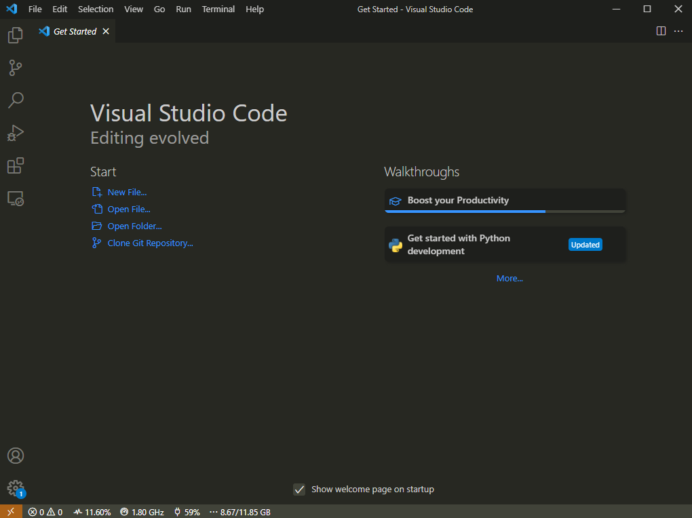
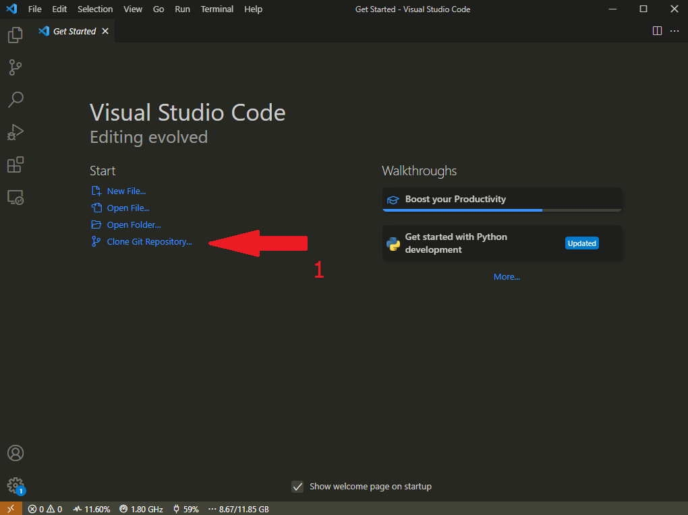
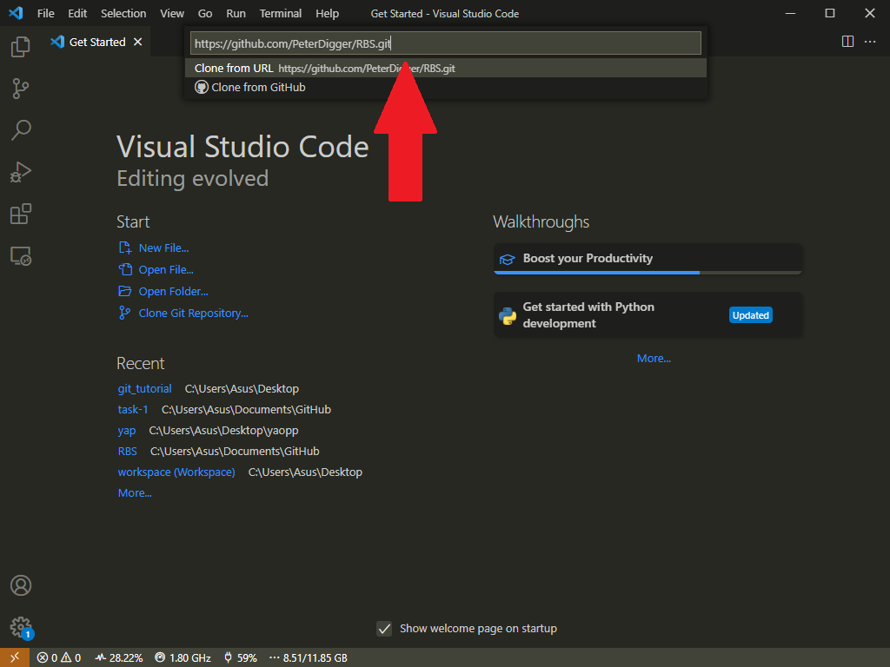
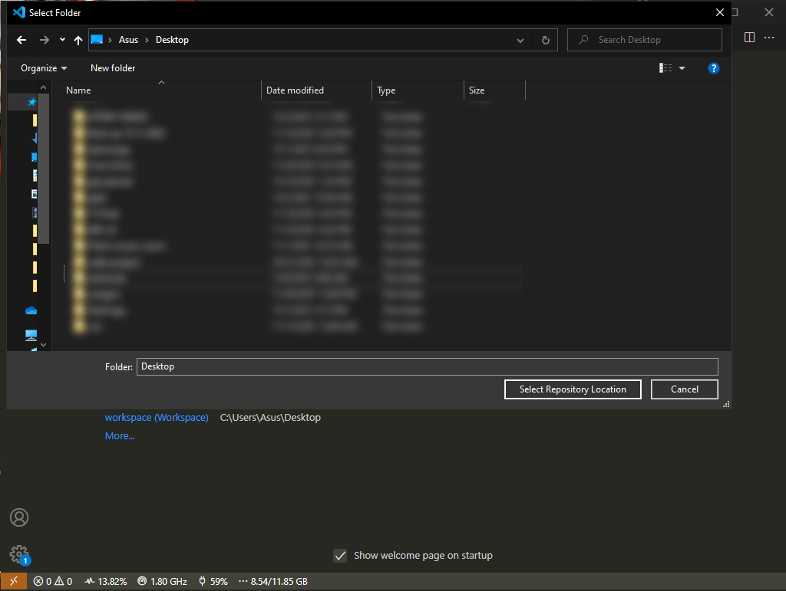
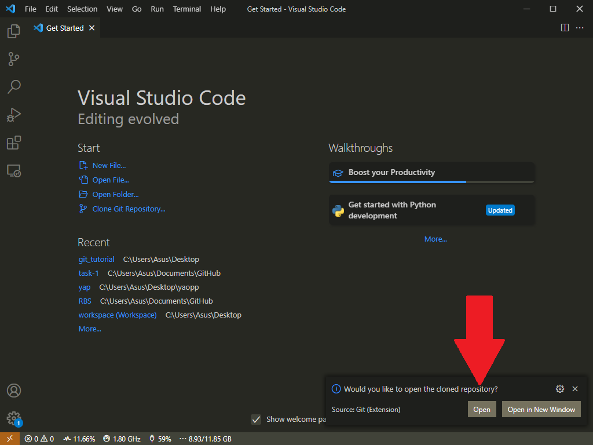
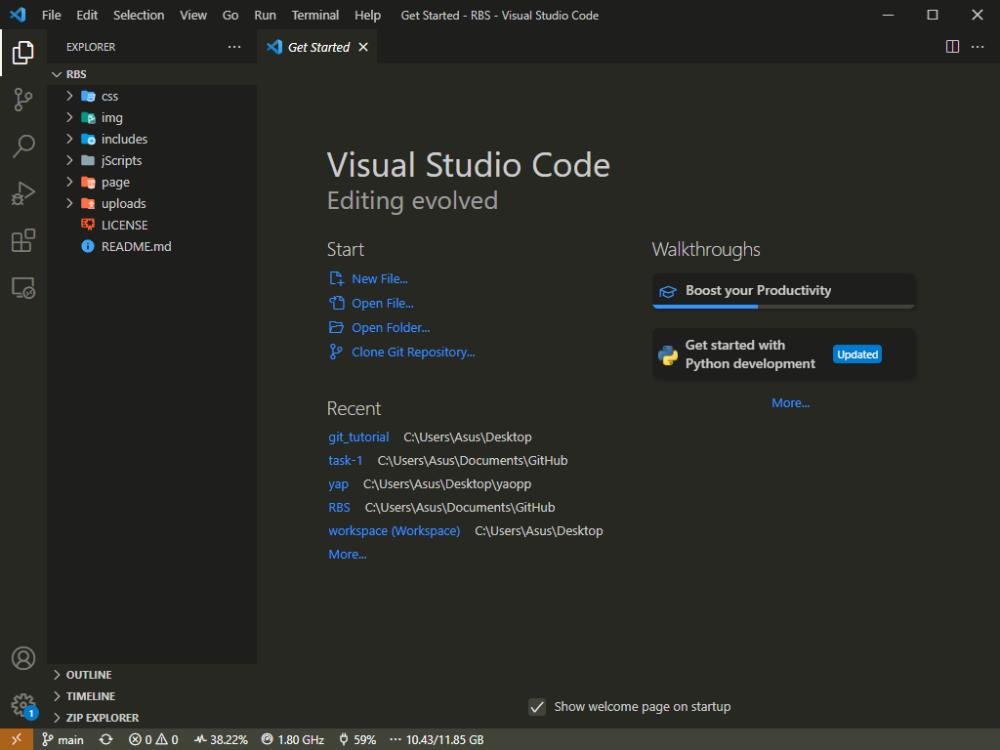

# How to setup a remote repository?

Return [Main Content](../README.md#main-content)

<button onclick="history.back()">Go Back</button>

## Git Bash <sub>[how to open git bash](gitbash.md)</sub>

1. open up your git bash and navigate to the your desired location,

    ```shell
    Asus@DESKTOP-N22CIQE MINGW64 ~
    $ cd Desktop/
    Asus@DESKTOP-N22CIQE MINGW64 ~/Desktop
    $ _
    ```

    ^ this will change your current location to desktop folder.

    [Terms](terms.md) used in the example:

    - `cd` = means "change directory(folder)"
    - `~` = means your home directory(folder)

2. To clone, type in `git clone`&nbsp;[*`the_link_to_GitHub_link`*](link.md)

    ```shell
    Asus@DESKTOP-N22CIQE MINGW64 ~/Desktop
    $ git clone https://github.com/PeterDigger/RBS.git ↩
    Cloning into 'RBS'...
    remote: Enumerating objects: 60, done.
    remote: Counting objects: 100% (60/60), done.
    remote: Compressing objects: 100% (38/38), done.
    remote: Total 60 (delta 21), reused 30 (delta 8), pack-reused 0
    Receiving objects: 100% (60/60), 10.04 KiB | 1.43 MiB/s, done.
    Resolving deltas: 100% (21/21), done.

    Asus@DESKTOP-N22CIQE MINGW64 ~/Desktop
    $
    ```

3. To nagivate inside the folder:

    ```shell
    Asus@DESKTOP-N22CIQE MINGW64 ~/Desktop
    $ cd RBS/

    Asus@DESKTOP-N22CIQE MINGW64 ~/Desktop/RBS
    $
    ```

4. To list all the files inside the folder,

    ```shell
    Asus@DESKTOP-N22CIQE MINGW64 ~/Desktop/RBS
    $ ls
    ```

    - `ls` means list all the non-hidden files inside the current directory (folder).

## Visual Studio Code

1. Open up VS Code/a new instance(window).

    

2. Click on `CLone Git Repository`

    

3. Paste in the GitHubt link

    

4. Choose a location to save the repository

    

5. Press "Yes" to open the repository in the VS Code

    

6. You will be presented something like this:

    

7. Done!
