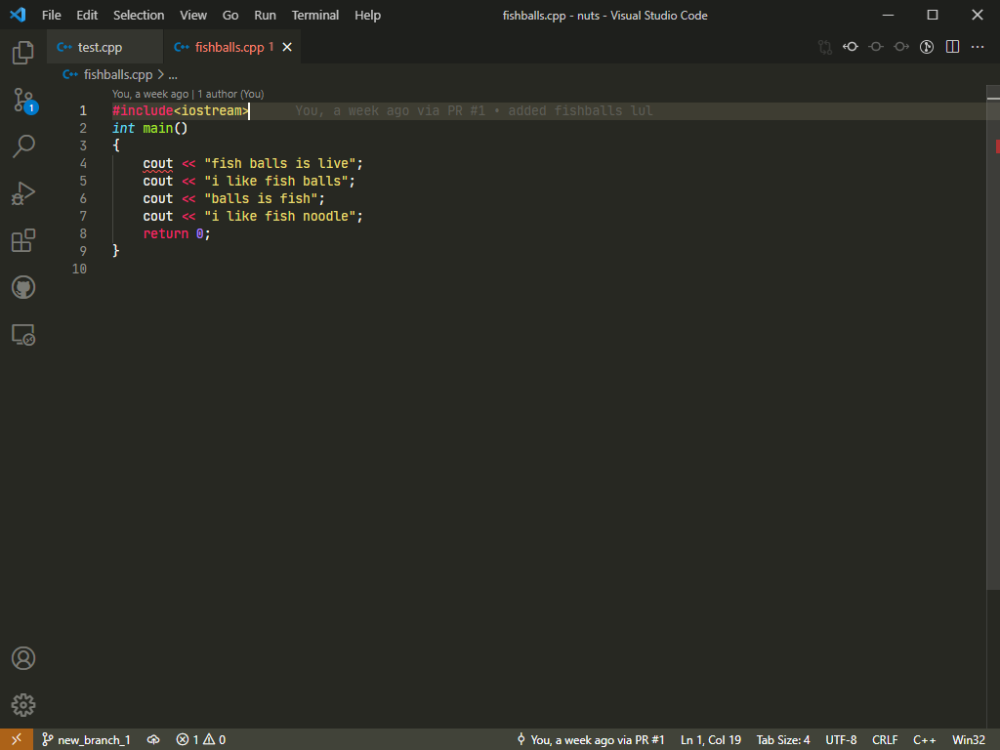
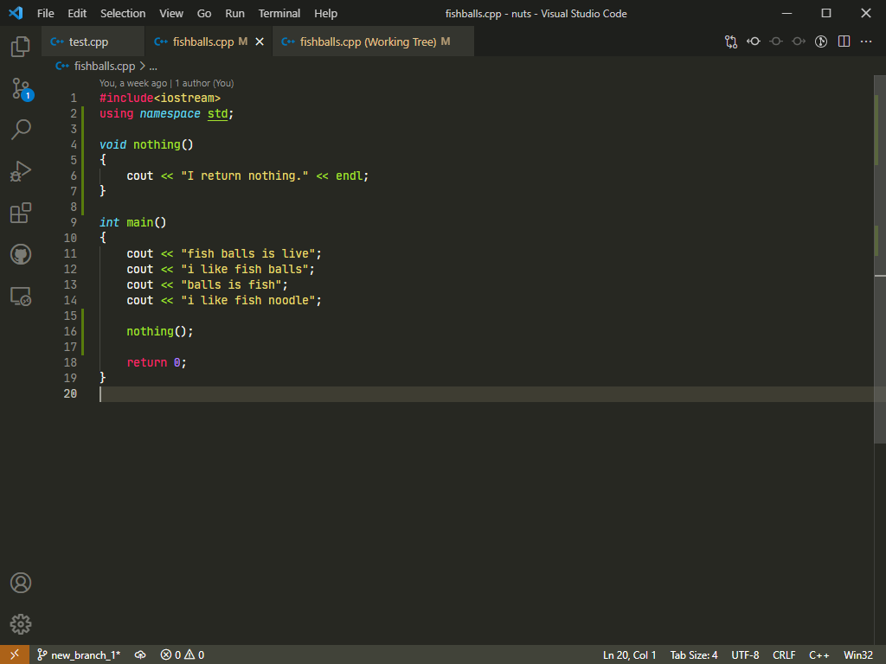
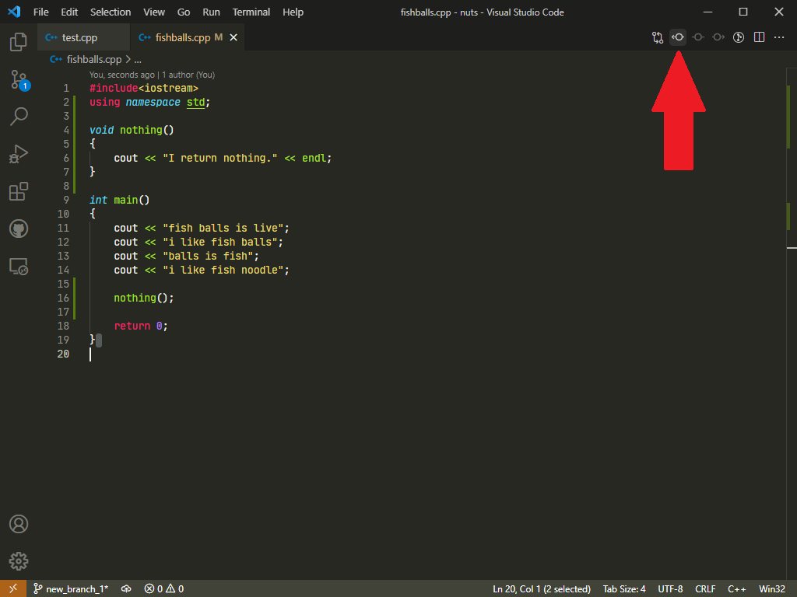
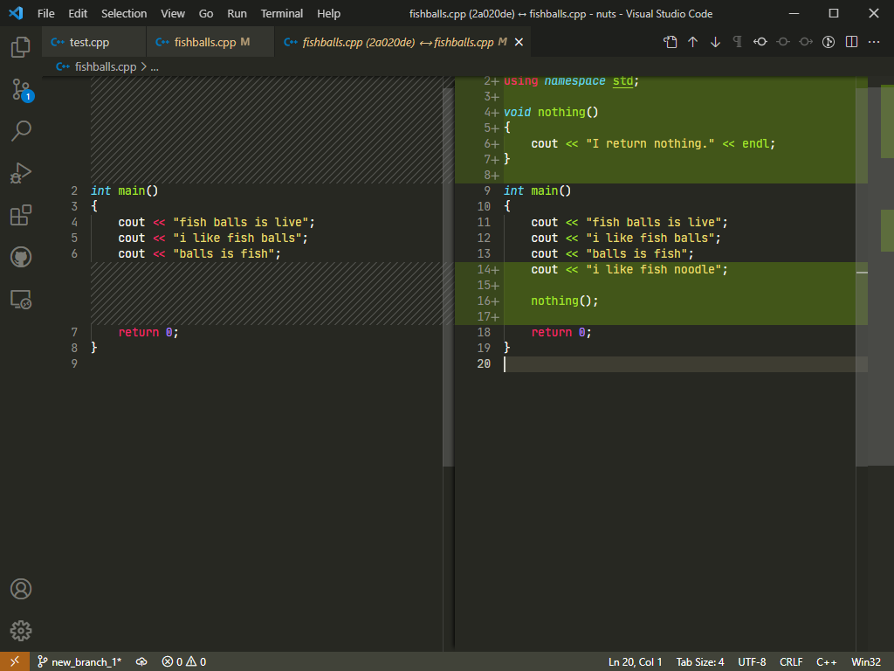
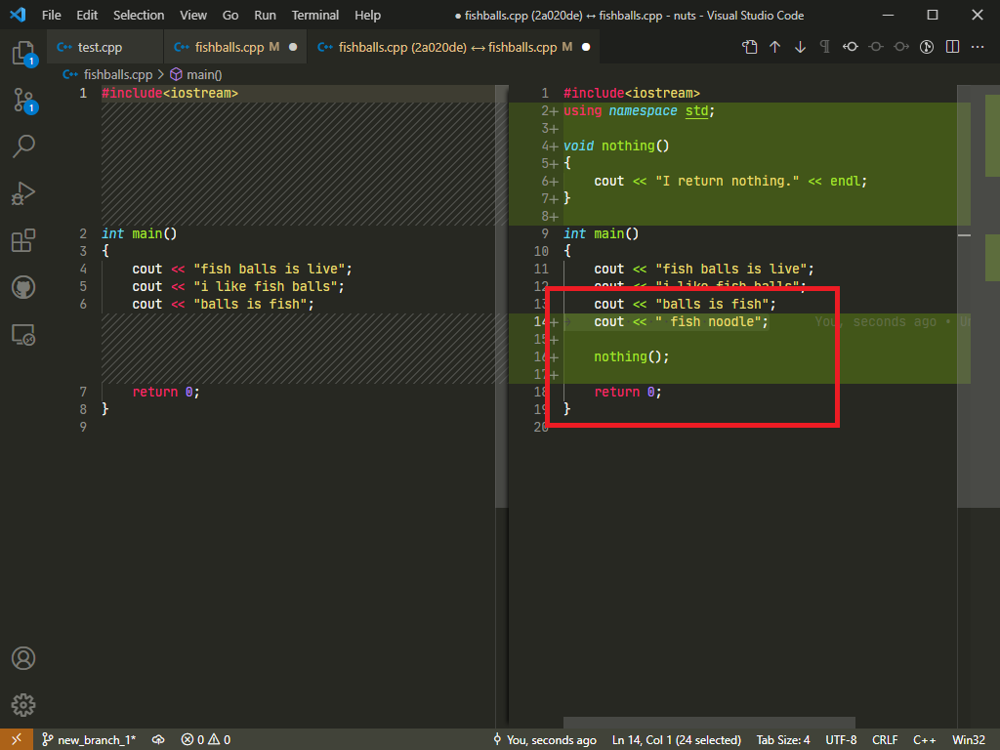
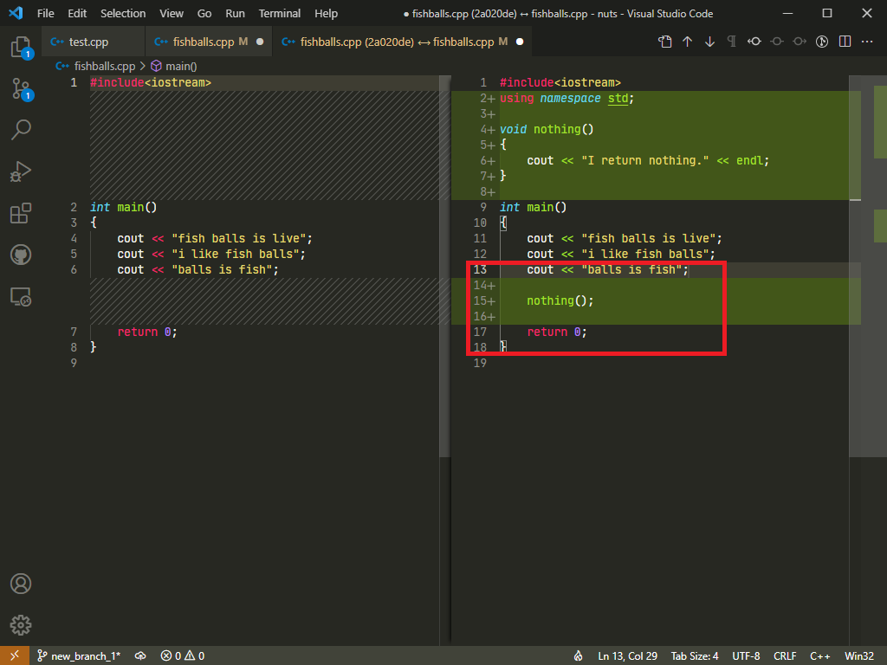

# How to revert a work

There's a moment where you wanted to revert the work done to a file. Here's how to revert a work/file.

Example: (fishballs.cpp)

## Git Bash

1. Open up [Git Bash](../done/gitbash.md)
2. [Navigate](../done/terms.md) to the project folder
3. Type in `git restore`&nbsp;*`file_that_you_wanted_to_restore`*

## Visual Studio Code

| Original Files                 | Modified Files                 |
|--------------------------------|--------------------------------|
|  |  |

To revert from modified files to unmodified/original file,

1. Click on the icon "arrow pointed to the left" on the top right corner

    

2. The VS Code will show you something like this,

    

3. To revert some part of the lines (for example, removing the line 14), you can directly edit on the right panel

    | Before                         | After                          |
    |--------------------------------|--------------------------------|
    |  |  |

4. And proceed with coding!
