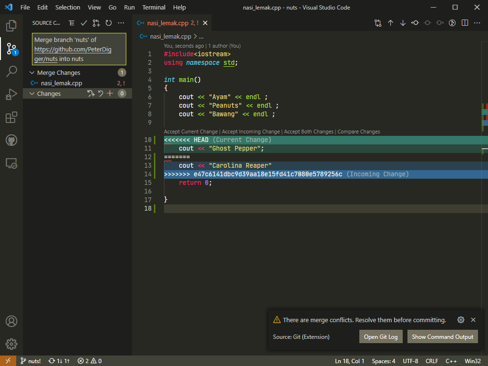
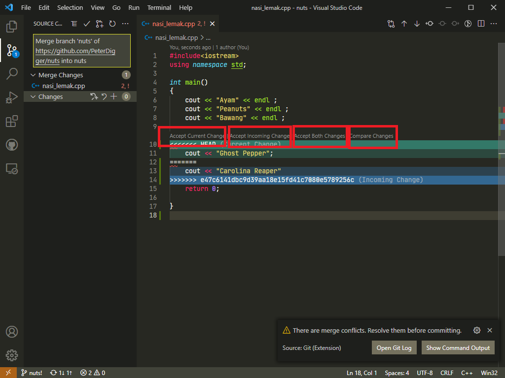
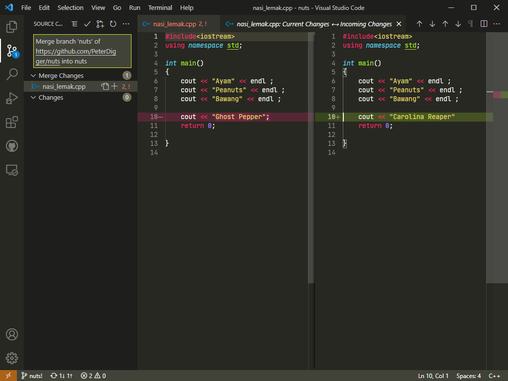
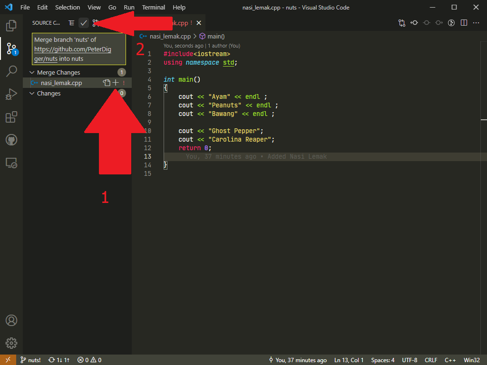

# How to resolve merge conflict?

Read:

- [What is merge conflict](conflict.md)?
- [What is merge](merge.md)?

`Git` will only add... in between two version

- "<<<<<<",
- "======",
- ">>>>>>"

To solve merge conflict,

- Visual Studio Code has detected merge conflict and *colour coded* them and give you four options to choose from.

1. Accept Current Change
2. Accept Incoming Change
3. Accept Both Changes
4. Compare Changes

`Compare Changes` allows you to compare side by side when codes get long and complicated.

Edit them and save them (in this case I accept both of them) then staged it and press "Commit" button

Now merge conflict resolved!
