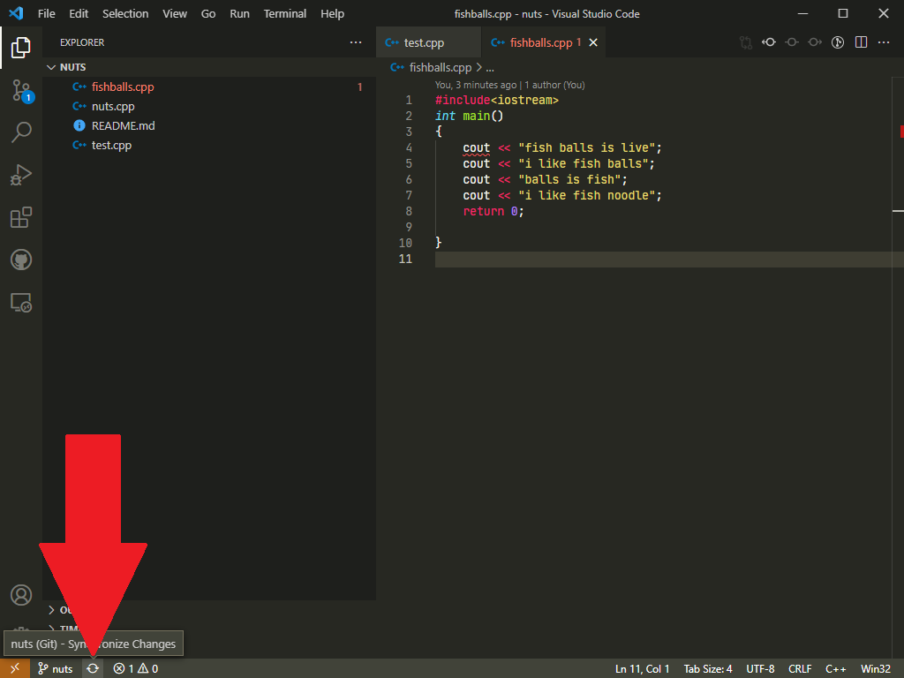
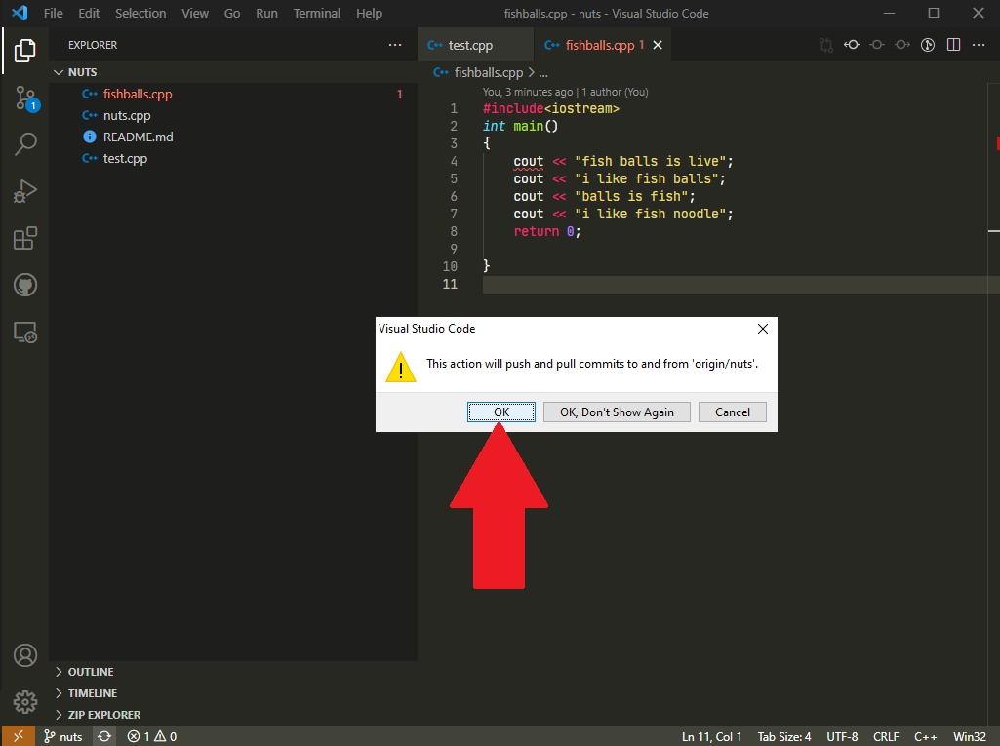

# How to get fetch/update the code from the GitHub

It is a good habit to always pull/fetch before you start edit your code. Just incase you missed out the commited work from your friend. If not, you will face the problem of [merge conflict](src/conflict.md).

How to fetch/update?

## Git Bash

1. Open your [Git Bash](../done/gitbash.md)
2. [Navigate](../done/terms.md) to your repository
3. Type in `git pull origin`&nbsp;[*`branch_name`*](../done/branch.md)
4. The command will display info of the latest commit.

## Visual Studio Code

1. Click on the "Refresh" button

    

2. Press "Ok" to confirm pull/refresh

    
