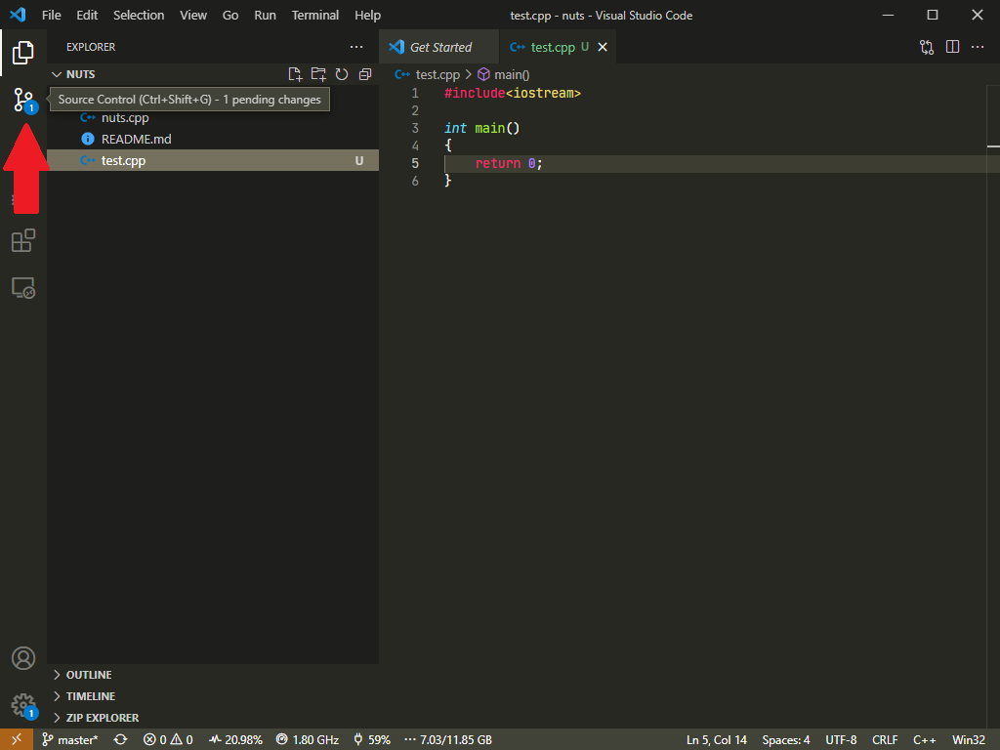
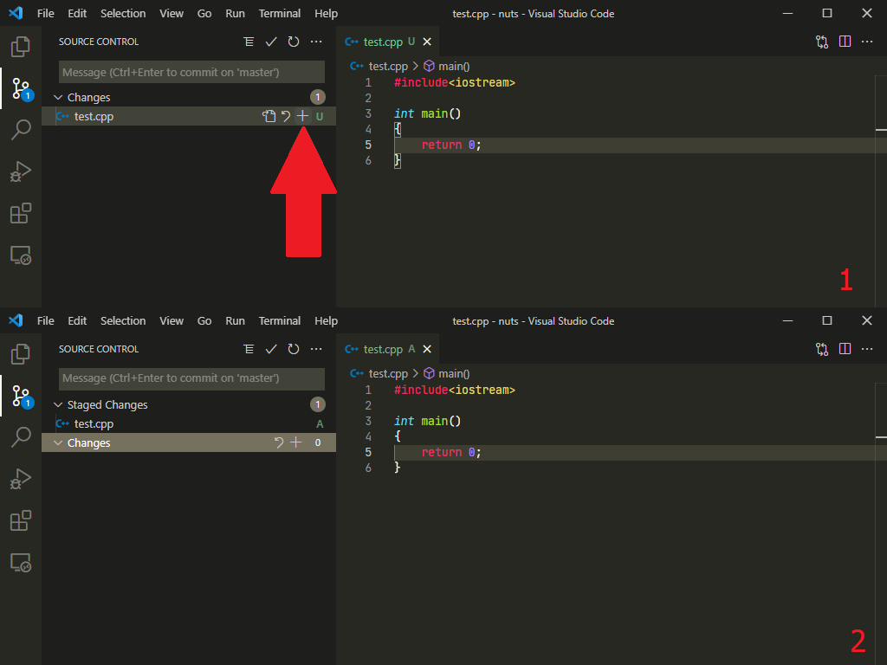
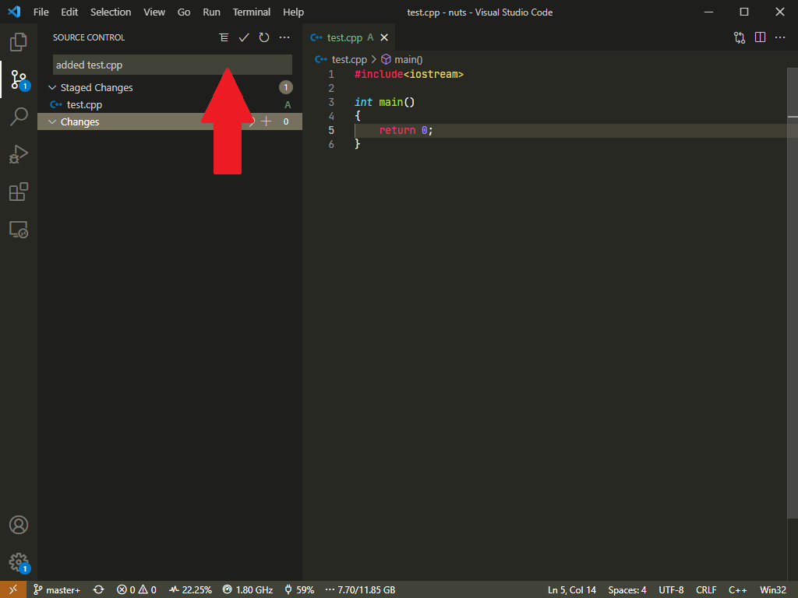
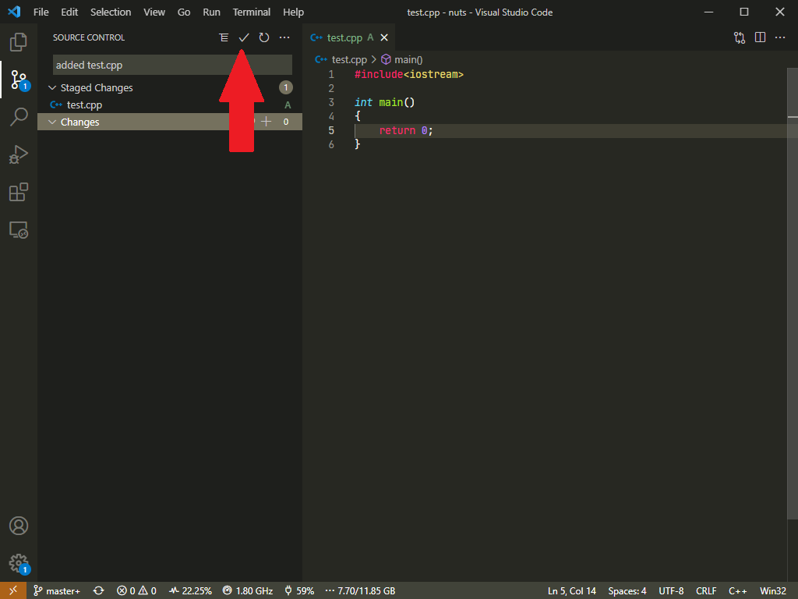
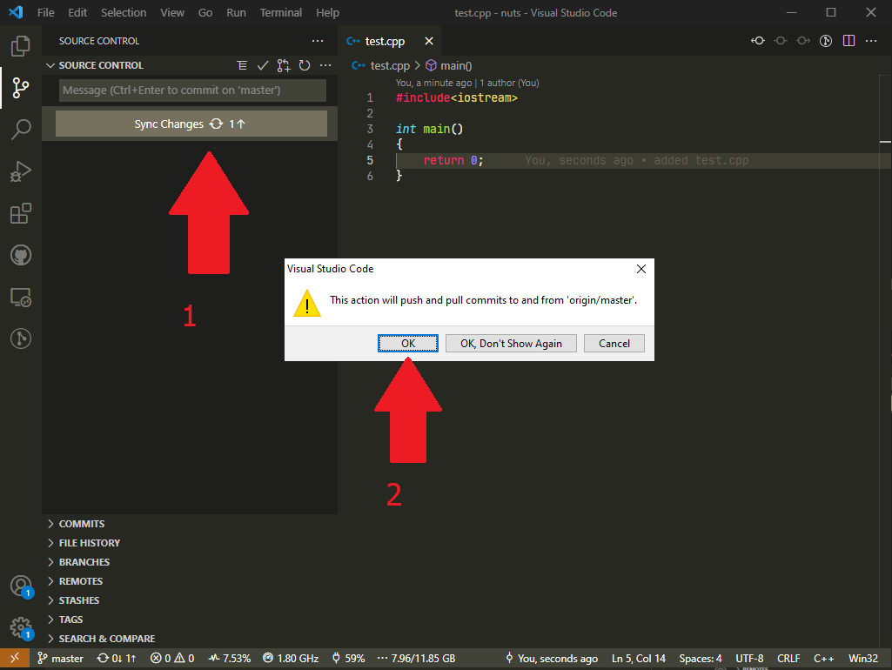

# How is it like to work on Git?

Return [Main Content](../README.md#main-content)

If we use an analog to explain how git works, it will be something like:

Imagine someone is ordering a food and you are the chef and you received the order,

## Analogy

1. You prep and cooked the food
2. Then you need to place in the container  
3. You labeled the container just in case the customer ate the wrong food.
4. Then you send it to customer.

## Computer Psuedo world

1. You worked on the code and found some mistakes or new lines of code.
2. After you code, you will need to save it and stage the file
3. You added in the commit message.
4. You pushed the modified/created file/s to the remote repository

## Typing in the actual stuff

### Git Bash

1. edit in VS code or any text editor of your choice and save it.
2. open up your Git Bash and type in `git add`&nbsp; *`modified_files`*
3. followed by `git commit -m "`*`commit message`*`"`
4. then finally, `git push origin`&nbsp;*`branch_name`*

### Visual Studio Code

1. Edit in VS Code as usual and save it.
2. Click on the "Source Control" button

    

3. Choose files to stage by clicking "+"

    

4. Enter the commit message

    

5. Click on "✓" to commit

    

6. Finally push it to remote

    
